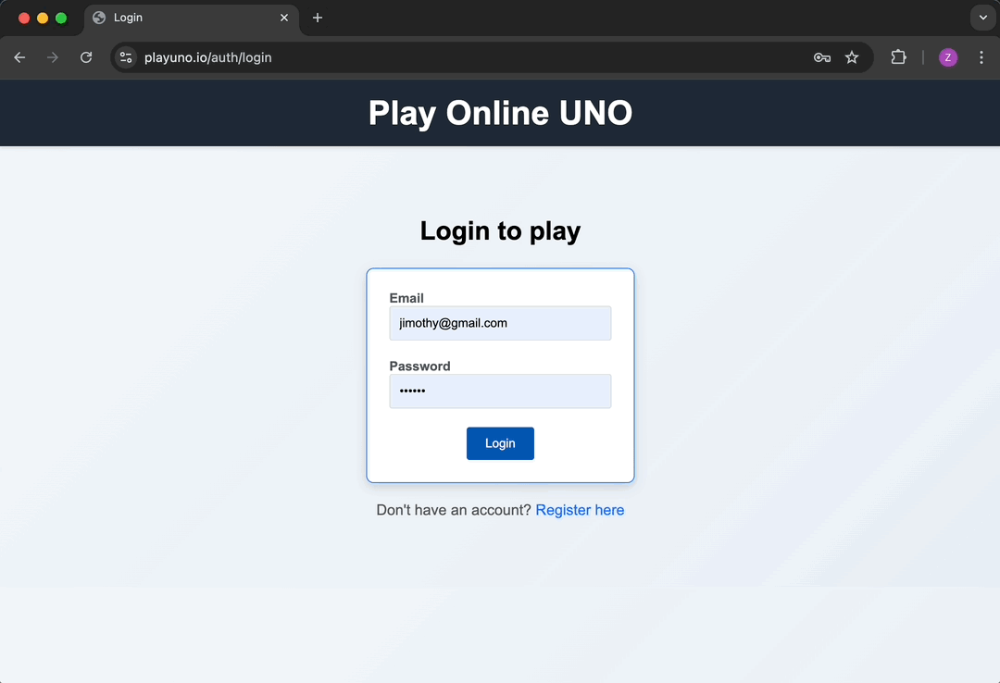

# Online Multiplayer UNO

Play UNO with friends in real time at [playuno.io](https://www.playuno.io) - a full-stack multiplayer game built with Node.js, Socket.io, Tailwind CSS, and PostgreSQL.

### Demo


## Features
- Real-time multiplayer with WebSockets  
- Persistent game state with user authentication
- Room creation and player join flow  
- Full UNO rules (Skip, Reverse, Draw2, Wild, Draw4)  
- Turn logic and move validation  
- Responsive UI
- Built-in chat
    
## Tech Stack
- **Backend:** Node.js, Express, Socket.io
- **Frontend:** EJS templates, Tailwind CSS, Toastify
- **Database:** PostgreSQL (Supabase on AWS)
- **Hosting:** Heroku

## Local Setup
1. Clone the repo
   ```bash
   git clone https://github.com/keyprocedure/real-time-uno.git
   cd real-time-uno
   ```
   
2. Install dependencies
  `npm install`

3. Create a `.env` file in the root directory
   ```bash
   DATABASE_URL=postgres://postgres:<password>@localhost:5432/<database_name>
   SESSION_SECRET=<secret_value>
   NODE_ENV=development
   ```
   
4. Set up the database schema
   ```bash
   npm run migrate
   ```

5. Build and run
   ```bash
   npm run build
   npm start
   ```
6. Open [http://localhost:8080](http://localhost:8080) and start playing!
